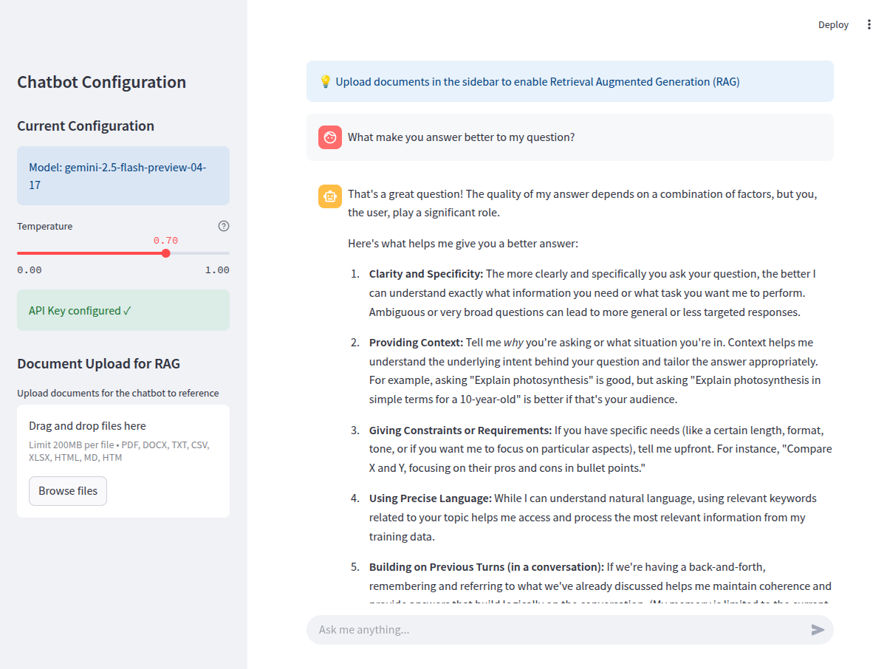

# Agentic RAG Chatbot with Gemini AI and Streamlit



A demo showcasing an agentic approach to Retrieval Augmented Generation (RAG) with Gemini AI and Streamlit.

## Features

- Interactive chat UI with Streamlit
- Gemini AI integration (API + LangChain)
- Document processing & semantic retrieval
- Multi-format support (pdf, docx, txt, csv, xlsx, html, md)
- Session state management
- Temperature control

## Quick Setup

```bash
git clone https://github.com/ccomkhj/llm-chatbot-demo.git
cd llm-chatbot-demo
python -m venv venv
source venv/bin/activate  # Windows: venv\Scripts\activate
pip install -r requirements.txt
```

### Add API Key

1. Get a Gemini API key from [Google AI Studio](https://makersuite.google.com/app/apikey)
2. Create `credentials.yaml` in the project root:

```yaml
API_KEY: "your_gemini_api_key_here"
AGENT_MODEL_NAME: "gemini-2.5-flash-preview-04-17"  # or another Gemini model
```

## Running the App

```bash
streamlit run main.py
```


1. **Upload Documents** (sidebar): Add files for the chatbot to reference
2. **Process** the documents to enable RAG capabilities
3. **Chat** with the model using the input at the bottom


## Agentic RAG Architecture

**Core Components:**

- **Document Processor**: Handles file ingestion and vectorization
- **LLM Interface**: Connects to Gemini AI via direct API or LangChain
- **Chat Interface**: Provides the conversational UI

**Key Capabilities:**

- Document understanding and semantic retrieval
- Context integration with conversation history
- Automatic switching between RAG and direct LLM access
- Temperature-controlled response generation

**Extension Possibilities:**

- External tool integration
- Multi-step reasoning chains
- Self-reflection mechanisms
